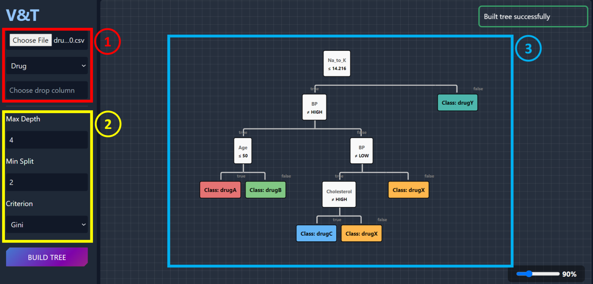

# Decision Tree Visualizer

A web application for building and visualizing decision trees from CSV data.



## Features

-   Build decision trees from CSV datasets
-   Customize model parameters (max depth, min samples split, criterion)
-   Visualize decision trees as hierarchical structures
-   Calculate and display model evaluation metrics
-   Interactive user interface

## Project Structure

-   `/model`: Contains the decision tree algorithm implementation
-   `/templates`: HTML, CSS, JS files for the web interface
-   `/datasets`: Sample datasets
-   `built_tree.py`: Main file for building and processing decision trees

## Requirements

-   Python 3.7+
-   Dependencies:
    ```bash
    pip install numpy pandas scikit-learn fastapi uvicorn
    ```

## Usage

1. Clone the repository
2. Install dependencies
3. Run the application:
    ```bash
    uvicorn app:app --reload
    ```
4. Open browser at `http://localhost:8000`
5. Upload a CSV file, select target column, set parameters, and click "Build Tree"

## Technologies

-   **Backend**: Python, FastAPI, NumPy, Pandas, Scikit-learn
-   **Frontend**: HTML, CSS, JavaScript, TailwindCSS
-   **Algorithm**: Decision Tree with Gini and Entropy criteria
